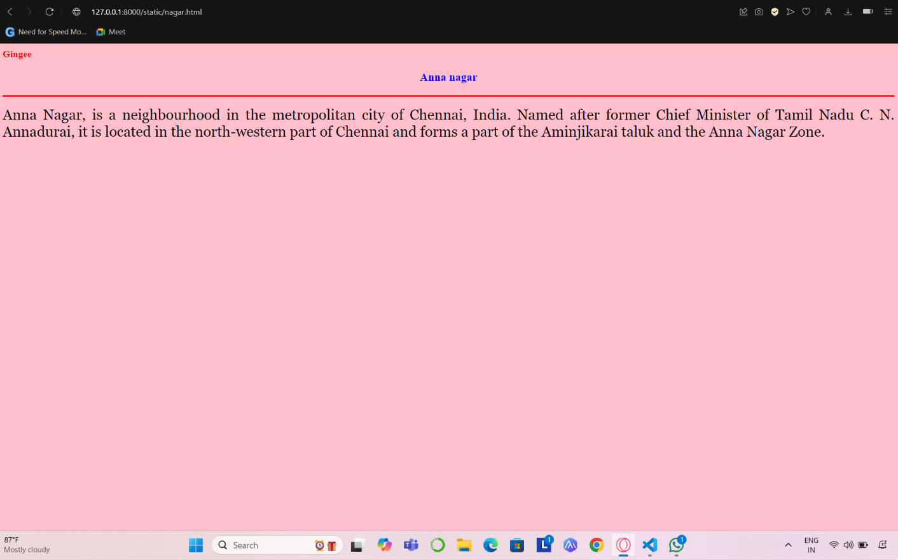

# Ex04 Places Around Me
## Date: 
11.12.2024
## AIM
To develop a website to display details about the places around my house.

## DESIGN STEPS

### STEP 1
Create a Django admin interface.

### STEP 2
Download your city map from Google.

### STEP 3
Using ```<map>``` tag name the map.

### STEP 4
Create clickable regions in the image using ```<area>``` tag.

### STEP 5
Write HTML programs for all the regions identified.

### STEP 6
Execute the programs and publish them.

## CODE
```
map.html


<html>
<head>
<title>My City</title>
</head>
<body>
<h1 align="center">
<font color="red"><b>Gingee</b></font> 
</h1>
<h3 align="center">
<font color="blue"><b>Pooja sri P (24007629)</b></font> 
</h3>
<center>

<map name="MyCity">
    <area shape="rect" coords="495,260,699,330" href="fort.html" title="Gingee fort"> 
    <area shape="rect" coords="910, 681, 760, 632" href="nagar.html" title="Anna nagar" >
    <area shape="rect" coords="345, 454, 550, 536" href="temple.html" title="Ekambaraswar temple" >
    <area shape="rect" coords="1315, 294, 1467, 376" href="hills.html" title="Dhaya hills" >
    <area shape="rect" coords="740, 698, 881, 747" href="nagar2.html" title="MGR nagar" >
    
</map>
</center>
</body>
</html>

fort.html

<html>
<head>
<title>My Home Town</title>
</head>
<body bgcolor="pink">
<h1 align="center">
</h1>
<font color="red"><b>Gingee</b></font>
<h3 align="center">
<font color="blue"><b>Gingee fort</b></font> </h3>
<hr size="3" color="red">
<p align="justify">
<font face="Georgia" size="5">
    Gingee Fort or Senji Fort (also known as Chenji, Chanchi, Jinji or Senchi) in Tamil Nadu, India is one of the surviving forts in Tamil Nadu, India.It is popularly known as Great Wall of South India.It lies in Villupuram District, 160 kilometres (99 mi) from the state capital, Chennai, and is close to the Union Territory of Puducherry. The site is so fortified that Chhatrapati Shivaji Maharaj, the Maratha king, ranked it as the "most impregnable fortress in India", and it was called the "Troy of the East" by the British. The nearest town with a railway station is Tindivanam and the nearest airport is Chennai (Madras), located 150 kilometres (93 mi) away.
</p>
</body>
</html>

hills.html

<html>
<head>
<title>My Home Town</title>
</head>
<body bgcolor="pink">
<h1 align="center">
</h1>
<font color="red"><b>Gingee</b></font>
<h3 align="center">
<font color="blue"><b>Highest Point of Dhaya Hills</b></font> </h3>
<hr size="3" color="red">
<p align="justify">
<font face="Georgia" size = "5">
Dhaya Hills is a place marked with the serenity of Daya River and lies at a distance of 8 Km from Bhubaneswar. The famous rock edicts of Ashoka are worth witnessing. Moreover, it is in Dhauli Hills that adopted the path of dharma which lets only peace and love enter your lives. The concept of dharma- vijay became his ultimate goal as he took Buddhist teachings deep into his heart. The end of the bloody battles was only to serve and favor mankind. With this, the religious and spiritual beliefs of Buddhism spread to different parts of the world. Dhauli Hills in Bhubaneswar takes you to the site of the Vishwa Shanti Stupa. The dome structure of the Shanti Stupa possesses five umbrellas and they symbolize the five essential parts of Buddhism.
</p>
</body>
</html>

nagar.html

<html>
<head>
<title>My Home Town</title>
</head>
<body bgcolor="pink">
<h1 align="center">
</h1>
<font color="red"><b>Gingee</b></font>
<h3 align="center">
<font color="blue"><b>Anna nagar</b></font> </h3>
<hr size="3" color="red">
<p align="justify">
<font face="Georgia" size="5">
    Anna Nagar, is a neighbourhood in the metropolitan city of Chennai, India. Named after former Chief Minister of Tamil Nadu C. N. Annadurai, it is located in the north-western part of Chennai and forms a part of the Aminjikarai taluk and the Anna Nagar Zone.
</p>
</body>
</html>

nagar2.html

<html>
<head>
<title>My Home Town</title>
</head>
<body bgcolor="pink">
<h1 align="center">
</h1>
<font color="red"><b>Gingee</b></font>
<h3 align="center">
<font color="blue"><b>M.G.R Nagar</b></font> </h3>
<hr size="3" color="red">
<p align="justify">
<font face="Georgia" size="5">
M.G.R. Nagar is a neighbourhood located in Chennai, India. The area is known for its busy vegetable market and fish market. 
</p>
</body>
</html>

temple.html

<html>
<head>
<title>My Home Town</title>
</head>
<body bgcolor="pink">
<h1 align="center">
</h1>
<font color="red"><b>Gingee</b></font>
<h3 align="center">
<font color="blue"><b>Sri ekambaraswar temple -Devotional Centre</b></font> </h3>
<hr size="3" color="red">
<p align="justify">
<font face="Georgia" size="5">
Ekambareswarar Temple, Chennai is a Hindu temple situated in the neighbourhood of Parry's corner, Chennai, India dedicated to Shiva. It was constructed by Alanganatha Pillai, chief merchant of the Madras factory of the British East India Company. 
</p>
</body>
</html>


```


## OUTPUT





## RESULT
The program for implementing image maps using HTML is executed successfully.
